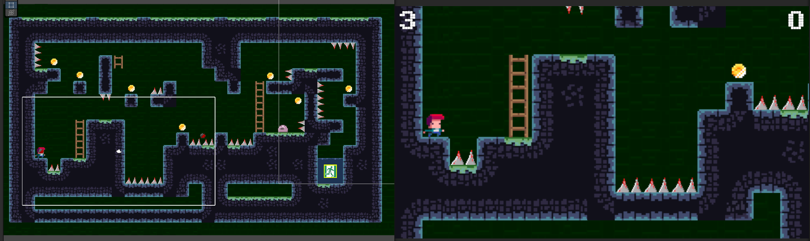

# Snow Boarder

Game made as part of the [Complete C# Unity Game Developer 2D](https://www.udemy.com/course/unitycourse/?couponCode=24T4MT90924B) tutorial series.

Features a 2D-Platformer with running, jumping, shooting, enemies, obstacles and collectibles!

Controls:
- Movement (WASD/Arrows)
- Jump: Spacebar
- Shoot: Left-mouse button

Objective: Reach the end of the 3 levels within the 3-life limit.

Built with:
- Cinemachine
- TileMaps using Physics2D Layers
- TextMeshPro
- New InputSystem
- Animations
